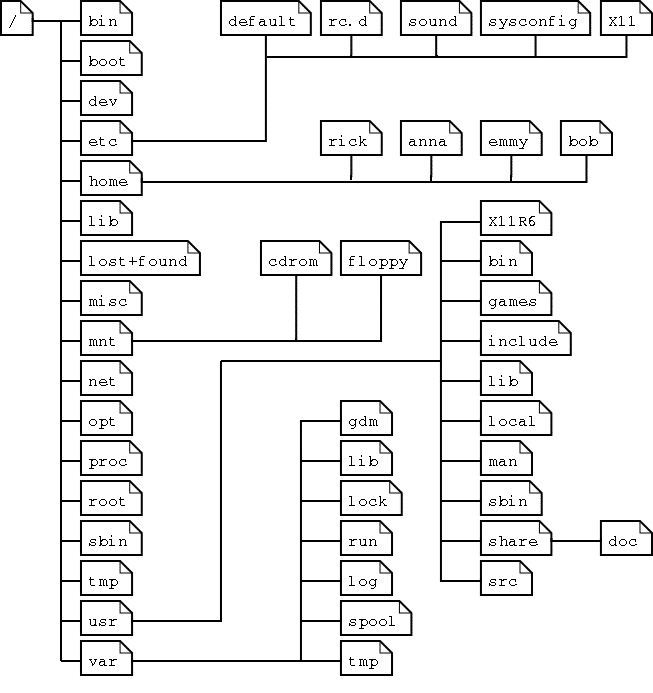

### Linux系统目录结构

1. 根目录: /

2. 常见和常用目录:

- /bin : 存放可执行二进制文件,shell可以执行的命令往往存放在这里

- /dev : 设备存放在这个目录下。（Linux一切皆文件） 
    - 挂载U盘在/dev路径下能找到
    - 硬盘,显卡,显示器等也放在其中。

- **/lib** : **Linux运行时需加载的动态库**

- /mnt: 手动挂载的目录

- /media: 外设的自动挂载目录

- **/root** : Linux超级用户的主目录

- **/usr** : **系统资源目录,存放用户的应用程序和文件,很重要**
    - 头文件 /usr/include 有 stdio.h stdlib.h
    - 游戏
    - 用户（通过源码configure）安装的应用程序默认目录 /usr/local
    - apt-get或yum系统自带包管理安装的应用程序
        - /var/cache/apt/archives   下载文件存放位置(Ubuntu)
        - /usr/share    安装后软件默认位置
        - /usr/bin  可执行文件位置
        - /etc  配置文件位置
        - /usr/lib  lib文件位置

- /etc ： 存放配置文件
    - /etc/passed   Linux的信息
    - /etc/group    用户组信息

- **/opt** : 安装第三方应用程序可以放这里,一般为空

- /home : Linux OS所有用户的主目录。

- **/tmp** ： **存放临时目录**,会自动清理

- /proc  : 是一个虚拟的路径,它是系统内存的映射,可以通过直接访问这个目录来获取系统信息。
