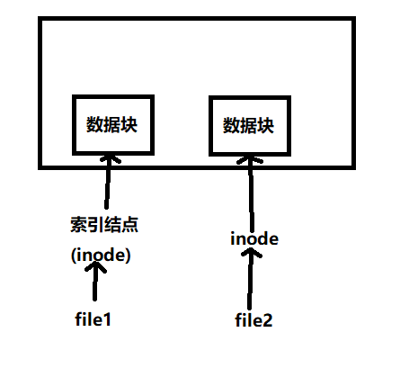

### Linux文件基础知识

#### 文件路径

1. 相对路径:
    - 从当前目录开始 例如: `./zoo/animal` 其中./表示当前目录
    - 使用相对路径进入 例如: `../zoo/animal` 其中../表示上一级目录

2. 绝对路径: 从根目录开始表示 比如当前你在`/home` 有一个文件在`/home/Test/xxx.txt`。xxx.txt的绝对路径为`/home/Test/xxx.txt` 相对路径为 `./Test/xxx.txt`

3. . 和 .. : 
    - `.`表示当前目录
    - `..`表示当前的上一级目录

4. ~ : `~`表示用户的主目录(也叫家目录)

#### Linux的文件类型

Linux一切皆文件,整个系统可以分为7种文件。

    - 普通文件: 比如 xx.txt , 压缩包
    - 目录文件
    - 符号链接(快捷方式)
    - 管道(pipe)
    - 套接字
    - 字符设备: 键盘,鼠标
    - 块设备: U盘, 硬盘

#### 软硬链接(ln)

软硬链接可以理解为windows的快捷方式。

- 软链接
    - 怎么创建软链接？ => `ln -s 文件名 快捷方式名` 
        - 文件名: 最好使用文件的绝对路径->使用绝对路径就可更改快捷方式名位置,而快捷方式名依旧链接至文件名。
        - 目录创建软链接: 与上述一致。

- 硬链接
    - 怎么创建硬链接？ => `ln 文件名 硬链接名字`

Linux文件组织示意图如下:

文件会在系统上存在一个索引结点(inode),然后通过inode指向相应的存放文件的数据块。

下面看一个场景:

1. 创建一个新文件file,此时硬链接到这个新文件的计数为1。

2. 给文件file创建了一个硬链接,此时硬链接到file的计数为2。

3. 删除硬链接,计数为1。

4. 删除对应文件,指向file的硬链接计数为0。

相应地硬链接的使用场景也能确定了:

- 磁盘上有一个大文件

- 在其他多个目录管理且能够实时同步