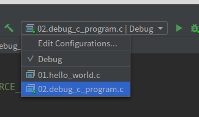
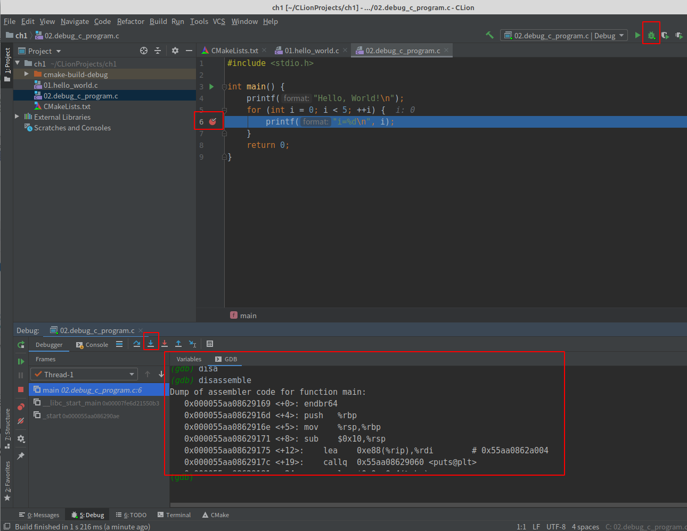
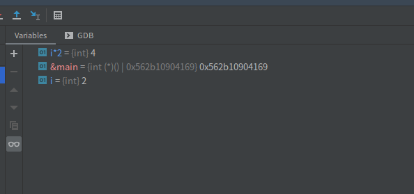
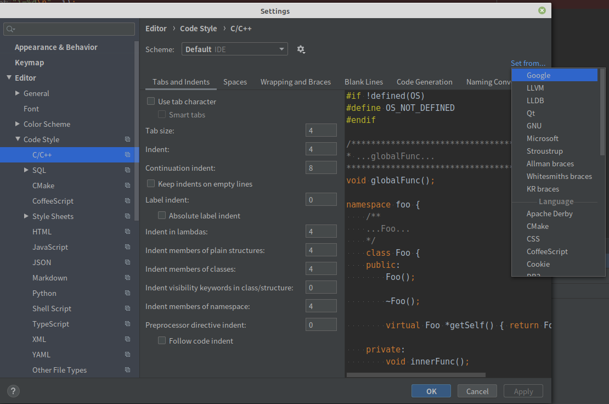

## C语言环境搭建以及调试

编译器推荐CLion比较好用。

将新建的cmake改为如下配置:
```cmake
cmake_minimum_required(VERSION 3.16)
# ${CMAKE_CURRENT_SOURCE_DIR}获取cmake源文件路径
get_filename_component(ProjectId ${CMAKE_CURRENT_SOURCE_DIR} NAME)
string(REPLACE " " "_" ProjectId ${ProjectId})
project(${ProjectId} C)

set(CMAKE_C_STANDARD 11)
# 获取每一个可执行程序,每一个可执行程序都通过add_executable添加到编译流程里
file(GLOB files "${CMAKE_CURRENT_SOURCE_DIR}/*.c")
foreach(file ${files})
    get_filename_component(name ${file} NAME)
    add_executable(${name} ${file})
endforeach()
```

这样编译选项就会如下,可以看到可以一个一个的编译或者调试单个源文件了。



## CLion基本调试



如上图所示在第6行打上断点,然后点击右上角的小虫子就是调试了。单步调试是左边的绿色大于号。与此同时还可以跳到gdb栏输入`disassemble`就是把现有代码翻译为汇编代码。

接下来看下图：



可以检测变量，以及给检测当前变量赋值后的结果。其中有趣的是`&main`也可以获取到,这里充分说明了函数是必然存在地址的。

## CLion google风格语法格式化



上面就是设置C项目的代码为google风格的。当写完代码后点击`Code->Reformat Code`就可以把代码改为google语法。
